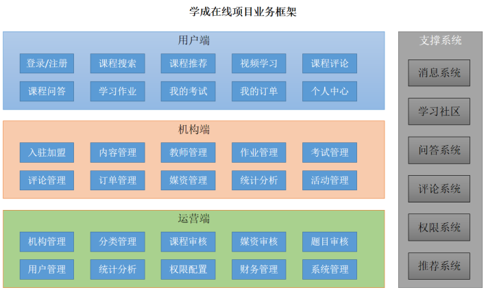

# 超星教辅（学成在线）网络课堂学习系统简介

## 1 项目业务介绍

本项目包括了用户端、机构端、运营端；

用户端：服务于学生群体，进行选课学习；

机构端：主要对课程内容，媒资信息进行管理；

运营端：课程审核，媒资审核，用户管理；

针对业务需求，增加了消息系统，权限管理系统方便业务处理。

核心模块包括：人员管理，内容管理、媒资管理、订单支付、选课管理、认证授权等。

下图是项目的功能模块图：

下边介绍业务流程：

##### 1.1 课程编辑与发布流程如下：

 

##### 1.2 课程发布后学生登录平台进行选课、在线学习。

免费课程可直接学习，收费课程需要下单购买。

学生选课流程如下：

## 2 项目技术架构

本项目采用前后端分离架构，后端采用**SpringBoot、SpringCloud**技术栈开发，数据库使用了**MySQL**，还使用的**Redis**、消息队列、分布式文件系统、**Elasticsearch**等中间件系统。

划分的微服务包括：内容管理服务、媒资管理服务、搜索服务、订单支付服务、 学习中心服务、系统管理服务、认证授权服务、网关服务、注册中心服务、配置中心服务等。

下图是项目的技术架构图：

各层职责说明如下：

| 名称     | 功能描述                                                     |
| :------- | :----------------------------------------------------------- |
| 用户层   | 用户层描述了本系统所支持的用户类型包括：pc用户、app用户、h5用户。pc用户通过浏览器访问系统、app用户通过android、ios手机访问系统，H5用户通过h5页面访问系统。 |
| CDN      | CDN全称Content Delivery Network，即内容分发网络，本系统所有静态资源全部通过CDN加速来提高访问速度。系统静态资源包括：html页面、js文件、css文件、image图片、pdf和ppt及doc教学文档、video视频等。 |
| 负载均衡 | 系统的CDN层、UI层、服务层及数据层均设置了负载均衡服务，上图仅在UI层前边标注了负载均衡。 每一层的负载均衡会根据系统的需求来确定负载均衡器的类型，系统支持4层负载均衡+7层负载均衡结合的方式，4层负载均衡是指在网络传输层进行流程转发，根据IP和端口进行转发，7层负载均衡完成HTTP协议负载均衡及反向代理的功能，根据url进行请求转发。 |
| UI层     | UI层描述了系统向pc用户、app用户、h5用户提供的产品界面。根据系统功能模块特点确定了UI层包括如下产品界面类型： 1）面向pc用户的门户系统、学习中心系统、教学管理系统、系统管理中心。 2）面向h5用户的门户系统、学习中心系统。 3）面向app用户的门户系统、学习中心系统。 |
| 微服务层 | 微服务层将系统服务分类三类：业务服务、基础服务、第三方代理服务。 业务服务：主要为学成在线核心业务提供服务，并与数据层进行交互获得数据。 基础服务：主要管理学成在线系统运行所需的配置、日志、任务调度、短信等系统级别的服务。 第三方代理服务：系统接入第三方服务完成业务的对接，例如认证、支付、视频点播/直播、用户认证和授权。 |
| 数据层   | 数据层描述了系统的数据存储的内容类型，关系性数据库：持久化的业务数据使用MySQL。 消息队列：存储系统服务间通信的消息，本身提供消息存取服务，与微服务层的系统服务连接。 索引库：存储课程信息的索引信息，本身提供索引维护及搜索的服务，与微服务层的系统服务连接。 缓存：作为系统的缓存服务，作为微服务的缓存数据便于查询。 文件存储：提供系统静态资源文件的分布式存储服务，文件存储服务器作为CDN服务器的数据来源，CDN上的静态资源将最终在文件存储服务器上保存多份。 |

## 3 项目环境搭建

项目基于JDK1.8环境开发，使用Mavne构建项目工程，首先安装开发工具，安装及配置步骤参考：学成在线项目开发环境配置。

学完第一章要求JDK、IDEA、Maven、Git、MySQL环境安装完成。

提示：如果虚拟机环境没有很快安装成功可先将MySQL数据库安装在本机，因为第二章的内容刚开始就要使用MySQL数据库。

MySQL8下载地址：https://dev.mysql.com/downloads/

本人使用Githhub仓库保存自己项目代码。

## 4 工程依赖关系

 学成在线使用 Maven 来进行项目的管理和构建。整个项目分为三大类工程：父工程、基础工程 和微服务工程。

每一种类的工程都有不同的作用，下面是对其功能进行说明：

• 父工程

￮ 对依赖包的版本进行管理 

￮ 本身为Pom工程，对子工程进行聚合管理 

• 基础工程

￮ 继承父类工程

￮ 提供基础类库

￮ 提供工具类库

• 微服务工程

￮ 分别从业务、技术方面划分模块，每个模块构建为一个微服务。

￮ 每个微服务工程依赖基础工程，间接继承父工程。

￮ 包括：内容管理服务、媒资管理服务、搜索服务、订单支付服务等。

## 5 微服务流程

下面我将以几个核心模块（服务）为例，简单介绍模块内的功能，执行流程等，关于更多详细的信息，参考docs里面的说明文档或参考下文链接即可。

#### 5.1 内容管理模块

##### 5.1.1 介绍

内容管理系统（content management system，CMS），是一种位于WEB前端（Web 服务器）和后端办公系统或流程（内容创作、编辑）之间的软件系统。内容的创作人员、编辑人员、发布人员使用内容管理系统来提交、修改、审批、发布内容。这里指的“内容”可能包括文件、表格、图片、数据库中的数据甚至视频等一切你想要发布到Internet、Intranet以及Extranet网站的信息。

本项目作为一个大型的在线教育平台，其内容管理模块主要对**课程及相关内容进行管理**，包括：课程的基本信息、课程图片、课程师资信息、课程的授课计划、课程视频、课程文档等内容的管理。

##### 5.1.2 业务流程

内容管理的业务由教学机构人员和平台的运营人员共同完成。

教学机构人员的业务流程如下：

1、登录教学机构。

2、维护课程信息，添加一门课程需要编辑课程的基本信息、上传课程图片、课程营销信息、课程计划、上传课程视频、课程师资信息等内容。

3、课程信息编辑完成，通过课程预览确认无误后提交课程审核。

4、待运营人员对课程审核通过后方可进行课程发布。

运营人员的业务流程如下：

1、查询待审核的课程信息。

2、审核课程信息。

3、提交审核结果。

下图是课程编辑与发布的整体流程。

##### 5.1.3 界面原型

产品工程师根据用户需求制作产品界面原型，开发工程师除了根据用户需求进行需求分析以外，还会根据界面原型上的元素信息进行需求分析。

内容管理模块的界面原型如下：

 

更多详细内容参考下面链接：

https://github.com/weilinlinlinlin/super_star_system/tree/master/docs/chapter2_content_v3.1

#### 5.2 媒资管理模块

更多详细内容参考下面链接：

https://github.com/weilinlinlinlin/super_star_system/tree/master/docs/chapter3_meida_v3.1

#### 5.3 课程发布模块

更多详细内容参考下面链接：

https://github.com/weilinlinlinlin/super_star_system/tree/master/docs/chapter4_release_v3.1

#### 5.4 学生选课模块

更多详细内容参考下面链接：

https://github.com/weilinlinlinlin/super_star_system/tree/master/docs/chapter6_learning_v3.1

## 6 项目整体架构

该图还未完工，敬请期待...

## 7 一些不足

1 没有考虑到并发场景，即没有进行压测，如需拓展为互联网项目，则需针对并发场景进行优化，例如乐观锁，分布式锁等；

2 未能充分利用缓存技术，提高系统的响应速度；

3 部分中间件采用单体模式，并未采用集群实现HA；

4 本项目针对分布式事务，采用本地消息表+分布式任务调度系统解决方案，并未采用Seata框架，可针对该点进行优化；

5 对于服务保护，没有提出解决方案，可以扩充Sentinel服务保护组件来实现对服务的监控，治理。